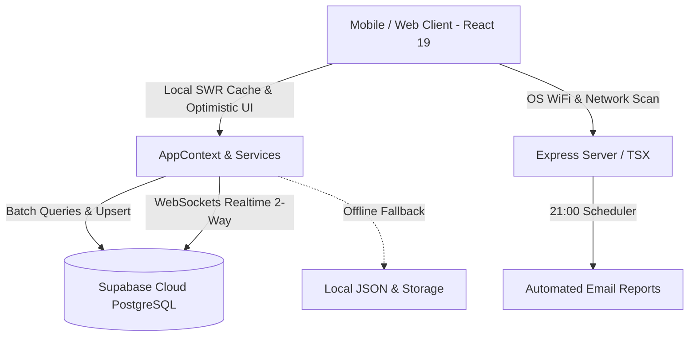

# Cháo Mầm Nhỏ Thái Thịnh - Hệ Thống Chấm Công & Quản Lý Ca F&B

Hệ thống quản lý chấm công, tính lương và phân ca tự động thế hệ mới dành riêng cho chuỗi cửa hàng **Cháo Mầm Nhỏ Thái Thịnh** (Hà Nội). Xây dựng trên nền tảng Clean Architecture, bảo mật đa lớp (Khóa kép WiFi & GPS, QR động), đồng bộ dữ liệu thời gian thực qua Supabase và tối ưu sâu công thái học trên thiết bị di động (Mobile-First Ergonomics).

---

## 🌟 Điểm Nổi Bật & Tính Năng Cốt Lõi

- **Khóa kép Bảo Mật (Dual-Lock WiFi & GPS)**:
  - Tự động nhận diện WiFi 2.4G / 5G của quán và kiểm tra dải IP mạng nội bộ.
  - Định vị tọa độ GPS có độ chính xác cao trong bán kính cho phép ($\le 80$m quanh cửa hàng).
- **Mã QR Động Chống Gian Lận (Dynamic Anti-Fraud QR)**:
  - Sinh mã QR động tự động làm mới theo chu kỳ (mặc định 45 giây) với chữ ký số bảo mật, ngăn chặn việc chụp ảnh màn hình gửi cho nhau.
- **Quản Lý Ca Làm Việc & Gộp Lượt Đa Năng (Multi-Turn Consolidation)**:
  - Tự động nhận diện Ca Sáng (06:00 - 12:00) và Ca Chiều (15:30 - 20:00).
  - Tự động gộp các lượt ra/vào liên tiếp trong cùng ca làm việc (khoảng cách $\le 60$ giây), tính lương chính xác từng phút.
- **Kiến Trúc Dữ Liệu Kép (Supabase Cloud + Local-First Fallback)**:
  - **Primary**: Supabase (PostgreSQL 15+, Row Level Security, Realtime WebSockets).
  - **In-Memory Cache (SWR)**: Bộ đệm thông minh tự hủy (auto-invalidation), triệt tiêu độ trễ mạng.
  - **Batch Operations**: Xử lý hàng loạt giúp giảm thời gian đồng bộ từ 10 giây xuống $\sim 120$ms.
  - **Fallback**: Tự động lưu trữ bộ đệm offline và đồng bộ lại ngay khi có kết nối.
- **Báo Cáo Tự Động & Bảng Lương Minh Bạch**:
  - Tự động tổng hợp và gửi email báo cáo ca trực tiếp cho chủ quán mỗi ngày lúc 21:00.
  - Bảng lương tháng chi tiết từng nhân viên, xuất dữ liệu nhanh sang Excel/CSV.
- **Giao Diện F&B Cao Cấp & Chuẩn Công Thái Học Di Động**:
  - Bảng màu đặc thù F&B: Than chì ấm `#141416`, Ngọc mầm Emerald `#10b981`, Hổ phách Amber `#f59e0b`.
  - 100% Vector SVG qua `lucide-react` (triệt tiêu toàn bộ icon emoji hệ điều hành).
  - Khắc phục triệt để lỗi tự động zoom màn hình trên iOS Safari (`text-base sm:text-xs`).
  - Giao diện dạng thẻ (Card-Based) trên mobile và bảng phẳng trên desktop.
  - Modal chuyển thành Bottom Sheet kéo từ đáy màn hình với đệm an toàn `pb-safe`.

---

## 🏗️ Kiến Trúc Hệ Thống (System Architecture)



### Phân Tầng Mã Nguồn (Clean Architecture)

- **Domain Layer (`src/domain/`)**: Các hàm nghiệp vụ thuần túy (Pure Functions), không phụ thuộc UI hay Framework (tính lương, gộp ca, kiểm tra GPS, bóc tách WiFi).
- **Service Layer (`src/services/`)**: Các Use-Cases điều phối nghiệp vụ (`attendance.service.ts`, `config.service.ts`, `user.service.ts`, `report.service.ts`).
- **Infrastructure Layer (`src/infrastructure/`)**: Kho dữ liệu (Repositories) kết nối Supabase và Local Storage theo Interface chuẩn.
- **Presentation Layer (`src/components/`, `src/context/`)**: Giao diện người dùng React 19, hook điều hướng và trạng thái toàn cục.
- **Server Controller Layer (`server/`)**: Express API phục vụ quét card mạng OS (`netsh`, `airport`, `nmcli`), tạo mã QR và lập lịch báo cáo tự động.

---

## 💻 Yêu Cầu Môi Trường & Cài Đặt

### Yêu Cầu Hệ Thống
- **Node.js**: Phiên bản 18.x trở lên (khuyên dùng Node 20 LTS).
- **Package Manager**: `npm` đi kèm Node.js.

### 1. Cài đặt Dependencies
```bash
npm install
```

### 2. Thiết lập Biến Môi Trường (.env)
Tạo file `.env` tại thư mục gốc của dự án:
```env
# Supabase Configuration
VITE_SUPABASE_URL=https://your-project.supabase.co
VITE_SUPABASE_ANON_KEY=your-anon-public-key
SUPABASE_SERVICE_ROLE_KEY=your-service-role-key

# Server Port (Mặc định 3000)
PORT=3000
```

### 3. Khởi tạo Cơ Sở Dữ Liệu Supabase
1. Đăng nhập vào [Supabase Dashboard](https://supabase.com/dashboard).
2. Vào mục **SQL Editor** của dự án.
3. Chạy toàn bộ mã lệnh trong tệp [`supabase/schema.sql`](supabase/schema.sql).
4. Di chuyển dữ liệu mẫu từ local lên Supabase:
```bash
npm run migrate:supabase
```

### 4. Khởi chạy Ứng Dụng
```bash
# Khởi chạy môi trường phát triển (Full-stack Express + Vite)
npm run dev

# Kiểm tra kiểu TypeScript (0 lỗi)
npm run lint

# Biên dịch Production Bundle
npm run build
```

Ứng dụng sẽ hoạt động tại: `http://localhost:3000` (hoặc truy cập qua IP mạng nội bộ của cửa hàng).

---

## 👥 Tài Khoản Mặc Định & Phân Quyền

| Vai trò | Tên đăng nhập | Mật khẩu mặc định | Quyền hạn |
| :--- | :--- | :--- | :--- |
| **Chủ quán / Quản lý** | `ptcong` | `12345678@Abc` | Quản lý ca trực tiếp, cài đặt mạng/GPS, quản lý nhân viên, xuất bảng lương, gửi báo cáo email. Hỗ trợ Google OAuth. |
| **Nhân viên phục vụ** | `nv01` | `123456` | Chấm công vào/ra ca, xem đồng hồ tính lương thời gian thực, xem lịch sử công của cá nhân, đổi mật khẩu. |

---

## 📜 Quy Ước Mã Nguồn & Tiêu Chuẩn

- **TypeScript Strict Mode**: 100% mã nguồn có định kiểu tường minh, không sử dụng `any` không kiểm soát.
- **Anti-Slop UI Guarantee**: Cấm sử dụng màu tím neon AI, không sử dụng hiệu ứng rung lắc/glow gây mất tập trung; ưu tiên độ tương phản và cảm giác vật lý nhạy (`active:scale-95`).
- **Git Commit Governance**: Không tự ý tạo commit hoặc push mã nguồn khi chưa có sự kiểm tra và đồng ý từ người quản trị.

---

## 📄 Bản Quyền

Dự án phát triển nội bộ cho chuỗi ẩm thực **Cháo Mầm Nhỏ Thái Thịnh**. Bảo lưu mọi quyền.
